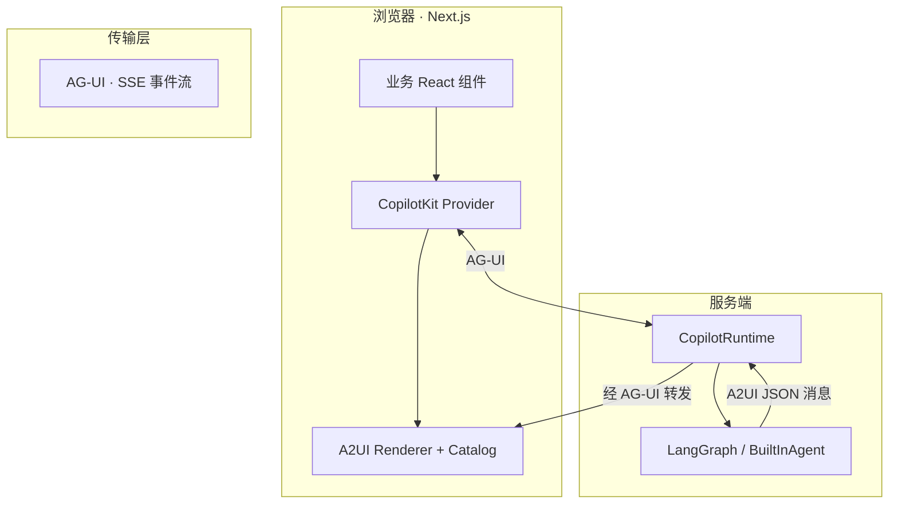

# AG-UI · A2UI · A2A · CopilotKit 协议栈

> W1–W2 必读。用**自己的话**补充「公司项目」列。

## 一层图



## 四者分工

| 协议/产品 | 层级 | 职责 | 类比 |
|-----------|------|------|------|
| **CopilotKit** | 产品/SDK | React 组件、Runtime、A2UI 中间件 | 「前端栈 + BFF」 |
| **AG-UI** | 传输/交互 | Agent↔App 双向事件（v2 默认 SSE） | WebSocket/SSE 上的「会话协议」 |
| **A2UI** | UI 声明 | Surface/Component/DataModel JSON | Agent 发的「UI 图纸」 |
| **A2A** | Agent 间 | 远程 Agent 互调（可选） | 微服务间的 gRPC |

**易混点**：AG-UI 和 A2UI **不是竞争关系**——AG-UI 运 A2UI（以及 Tool 事件、文本 delta 等）。

## CopilotKit v1 → v2 迁移要点

| v1 | v2 |
|----|-----|
| GraphQL | AG-UI (SSE) |
| `CopilotKit` | `CopilotKitProvider` |
| `useCopilotAction` | `useFrontendTool` |
| `useCopilotReadable` | `useAgentContext` |
| `useCoAgent` | `useAgent` |
| `copilotRuntimeNextJSAppRouterEndpoint` | `createCopilotRuntimeHandler` |

本仓库 **一律按 v2** 学习。

## 与 openharness / python-ai 的边界

| 组件 | 负责 |
|------|------|
| **copilotkit-a2ui**（本轨） | Web 端 Agent UX、A2UI Catalog、Copilot Runtime |
| **python-ai** | LangGraph 业务图、Tool、RAG |
| **openharness** | CLI/Gateway/IM 通道、Harness 治理 |

公司典型链路：

```
用户浏览器 → CopilotKit (AG-UI) → LangGraph (python-ai) → MCP/DB
飞书用户   → openharness ohmo Gateway → 同一 LangGraph（远期统一）
```

## 自查（P0）

- [ ] 能说明 AG-UI 运的是什么
- [ ] 能说明 A2UI 为何不执行任意 JS
- [ ] 知道 Runtime 跑在 Next `route.ts` 而非浏览器

---

*公司项目记录：*

| 场景 | 传输 | UI 模式 |
|------|------|---------|
| | | |
