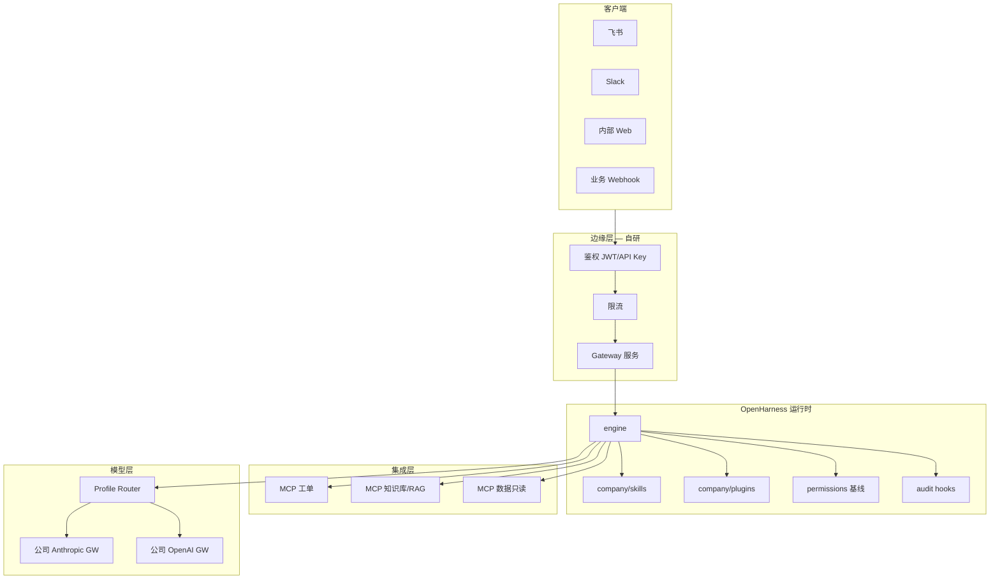

# 公司统一 Agent 后端 · 目标架构蓝图

> P5 定稿前为草案；实施时替换「待定义」为公司实际系统名。

## 业务目标

- **一个后端**服务多条通道（飞书、Slack、内部 Web、Webhook）
- **一套 Skills** 承载公司流程与规范
- **一组 MCP** 连接 CRM、工单、知识库、数据库（只读优先）
- **统一 LLM Profile** 对接公司模型网关（OpenAI / Anthropic Compatible）
- **可审计、可回滚、可 onboarding**

## 逻辑架构



## 配置仓库结构（`p5-company-agent-platform`）

```
company-agent-backend/
├── config/
│   ├── profiles/
│   │   ├── prod.yaml          # 生产模型 profile
│   │   └── staging.yaml
│   ├── settings.json          # permission 基线
│   └── mcp/
│       ├── servers.json       # MCP 清单 + 启用开关
│       └── README.md
├── skills/                    # 公司级 SKILL.md（版本 tag）
│   ├── incident-response/
│   ├── deploy-checklist/
│   └── ...
├── plugins/
│   └── internal-workflows/
├── gateway/
│   ├── app.py                 # FastAPI / ohmo 扩展
│   ├── channels/              # feishu / webhook / ...
│   └── session_store/         # 可选 Postgres
├── audit/
│   └── schema.json            # 审计字段定义
└── deploy/
    ├── Dockerfile
    ├── docker-compose.yml
    └── runbook.md
```

## 非功能需求（NFR）

| 维度 | 目标 | 实现要点 |
|------|------|----------|
| 安全 | 写操作可审计 | PostToolUse Hook → 结构化 log |
| 安全 | 最小权限 | default mode + MCP 只读 + path_rules |
| 可用 | Gateway 可重启 | 会话外置 store；Harness 无状态 |
| 成本 | 可追踪 | 内置 token 计数 + 按 profile 汇总 |
| 合规 | 密钥不入库 | K8s Secret / Vault |
| 运维 | 可预览 | 发布前 `oh --dry-run` 流水线 |

## 与 OpenHarness 开源版差距（必补清单）

| 能力 | 开源版 | 公司实现 | 负责阶段 |
|------|--------|----------|----------|
| SSO | 无 | Gateway JWT + IdP | P5 |
| 多租户 | profile 级 | session namespace + authz | P4–P5 |
| 集中日志 | debug 日志 | audit + ELK/Loki | P5 |
| HA | 单进程 | Gateway 多副本 + 队列 Task | P6 |
| RBAC | permission mode | 角色 → Tool 白名单 | P5 |

## 发布流水线（建议）

```
1. PR → CI：`oh --dry-run` + MCP config lint + Skills 格式检查
2. merge → staging：compose up + 冒烟 Webhook 对话
3. tag → prod：蓝绿或滚动；回滚保留上一版 Skills tag
```

## MVP 范围（W11–W12 必须交付）

- [ ] 1 个 Webhook 通道可对话
- [ ] ≥3 公司 Skills
- [ ] ≥1 MCP（只读）
- [ ] 鉴权 + 审计 log 样例
- [ ] docker compose 一键启动
- [ ] ADR + 30 分钟 onboarding README

---

*待定义：公司 IdP、模型网关 URL、飞书 App ID、日志平台*
