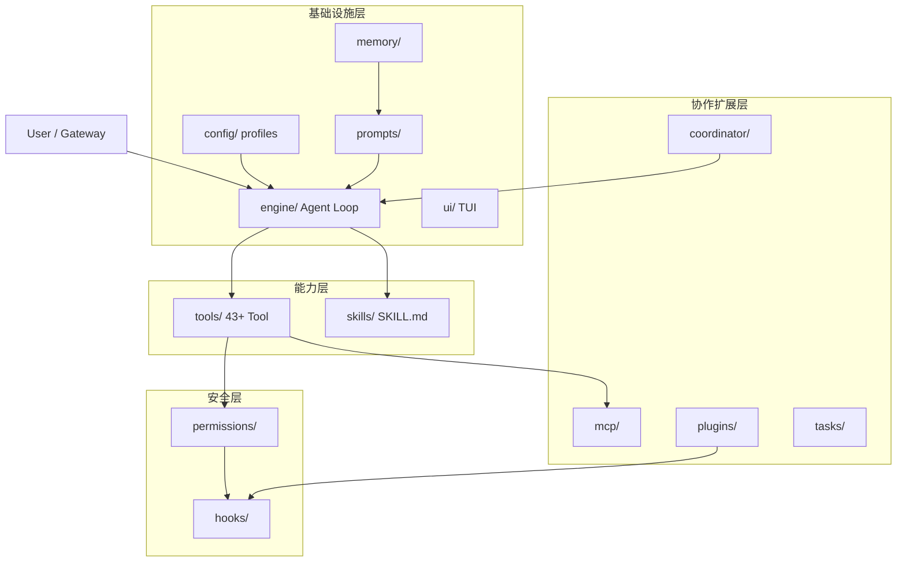
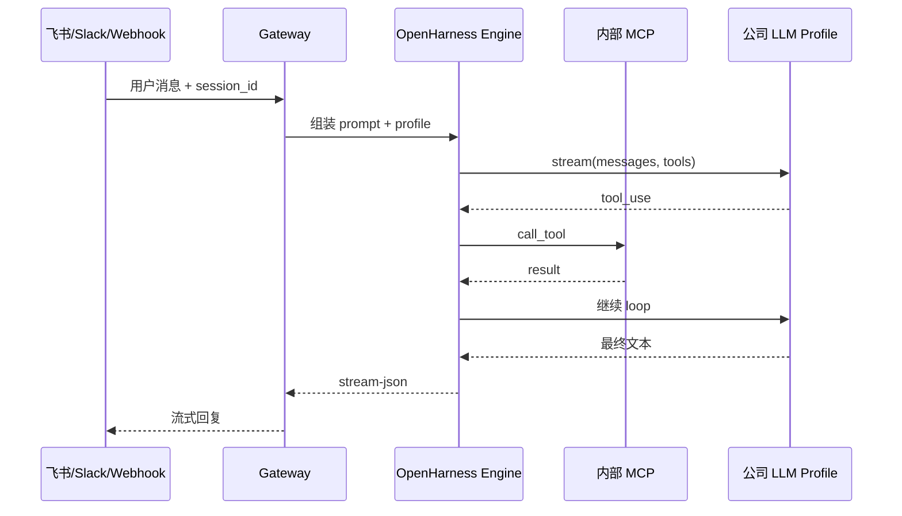

# Harness 十子系统心智模型

> W1–W2 专用。对照 [OpenHarness 源码](https://github.com/HKUDS/OpenHarness) 持续更新。

## 四层架构



## Agent Loop（核心）

```python
# 伪代码 — 对应 engine/ 实现
while True:
    response = await api.stream(messages, tools)
    if response.stop_reason != "tool_use":
        break
    for tool_call in response.tool_uses:
        if not permissions.allow(tool_call):
            result = permission_denied()
        else:
            hooks.pre(tool_call)
            result = await registry.execute(tool_call)
            hooks.post(tool_call, result)
        messages.append(result)
```

**费曼三句话（请改成你自己的话）**：

1. **Engine**：把用户消息和 Tool 列表发给模型，直到模型不再请求 Tool。
2. **Tool Registry**：模型选 Tool；Harness 负责校验、权限、执行、把结果塞回上下文。
3. **与 LangChain 差异**：LangChain 在**应用代码**里写 Agent；OpenHarness 是**运行时壳**，Tool/Skill/Plugin 可插拔。

## 十子系统速查

| 子系统 | 一句话 | 公司后端关注点 |
|--------|--------|----------------|
| engine | Agent Loop 调度 | 调 `--max-turns`、流式、重试 |
| tools | 内置能力目录 | 禁用危险 Tool，加域 Tool |
| skills | 按需 .md 知识 | 公司流程、规范、Runbook |
| plugins | 命令+Hook+Agent 包 | 内部工作流插件 |
| permissions | 写/执行前门禁 | 生产 default + path_rules |
| hooks | 生命周期拦截 | **审计日志**主挂载点 |
| commands | /plan /commit 等 | 运维 slash 命令 |
| mcp | 外部 Tool 协议 | **内部系统主接入方式** |
| memory | 跨会话 MEMORY.md | 团队知识 vs 用户私有 |
| coordinator | 子 Agent / Team | 复杂工单拆分 |
| tasks | 后台长任务 | 慢 MCP / 报告生成 |
| prompts | CLAUDE.md 注入 | 公司级 system 规则 |
| config | profile / settings | **多环境多模型路由** |
| ui | React TUI | 开发调试；生产用 Gateway |

## 请求路径（公司 Gateway 场景）



## 自查（P0 验收）

- [ ] 能指出一次 tool 调用经过哪些子系统
- [ ] 能说明 Skills 何时加载（非启动时全量）
- [ ] 能解释 `--dry-run` 不执行哪些步骤

---

*薄弱点记录：*

- 
- 
