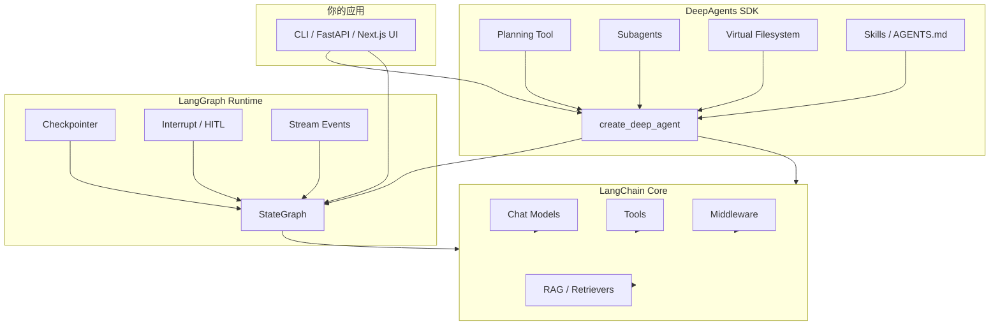

# LangChain 生态地图

## 三层产品关系



## 核心包对照

| PyPI 包 | 职责 |
|---------|------|
| `langchain` | 模型、Prompt、Tool、Agent 高层 API |
| `langchain-core` | 抽象接口（Runnable、Message） |
| `langchain-openai` / `langchain-anthropic` 等 | Provider 集成 |
| `langgraph` | 图运行时、持久化、流式 |
| `deepagents` | 深代理脚手架（基于 LangGraph） |
| `langsmith` | Trace、评测、监控 |

## Middleware 在 Agent 循环中的位置

```
User Input
    ↓
[Middleware: before_agent]
    ↓
[Middleware: before_model]  ← 可 trim 历史、注入 system
    ↓
Model Call
    ↓
[Middleware: after_model]   ← 可解析 structured output
    ↓
Tool Execution（若有）
    ↓
[Middleware: after_agent]
    ↓
Response
```

DeepAgents 默认带一叠 middleware；用 `create_agent` 时需自行组合。

## 与仓库其他领域的连接

| 本领域概念 | reactjs 领域类比 |
|------------|------------------|
| StateGraph state | React state + reducer |
| Checkpoint | SSR session / DB 持久化 |
| Tool | Server Action / API Route |
| Middleware | Next.js middleware |
| RAG Retriever | TanStack Query 数据源 |
| LangSmith trace | React DevTools + Lighthouse |

## 官方文档入口

- 生态总览：https://docs.langchain.com/oss/python/concepts/products
- LangChain Agents：https://docs.langchain.com/oss/python/langchain/agents
- LangGraph：https://docs.langchain.com/oss/python/langgraph/overview
- DeepAgents：https://docs.langchain.com/oss/python/deepagents/overview
