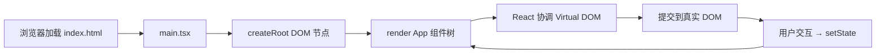

# React 心智模型（W1 周一）

## 请求到页面的流程

## 三句话费曼（请改成你自己的话）

1. **组件**：接收 props、返回 JSX 的函数；UI 是状态的函数 `UI = f(state)`。
2. **渲染**：React 对比前后 Virtual DOM，只更新变化的真实 DOM 节点。
3. **与 Vue 最大不同**：React 不会自动追踪依赖；状态变了要显式 `setState`，副作用要手写 `useEffect` 依赖数组。

## 自查

- [ ] 能指着 `main.tsx` 说出 createRoot 在哪
- [ ] 能指出 App 里哪些是 props、哪些是 state（周三 Counter）
